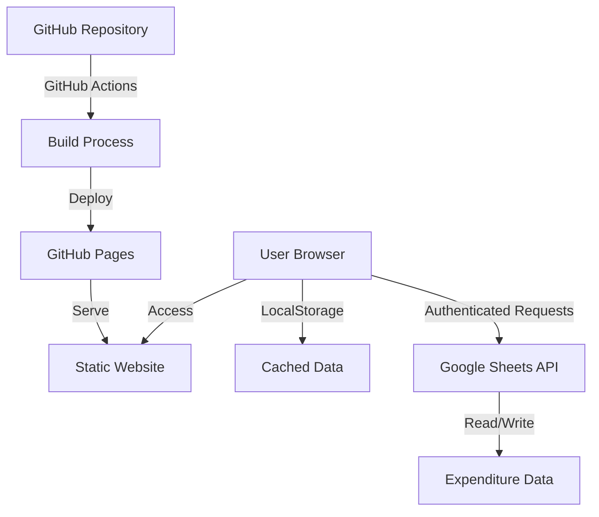
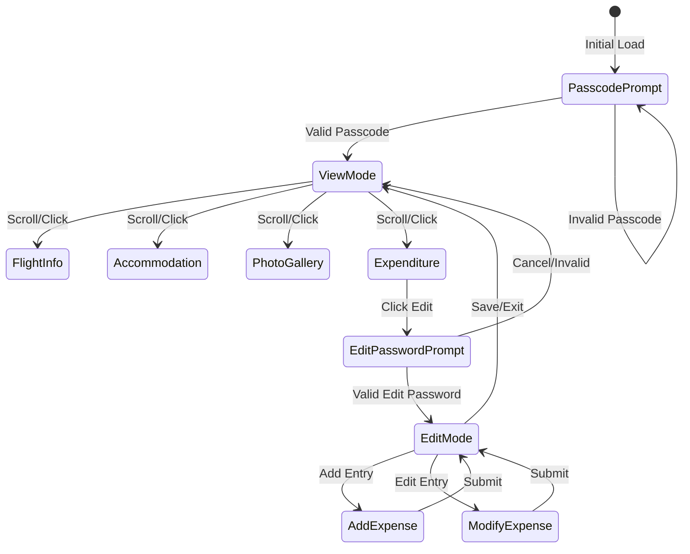
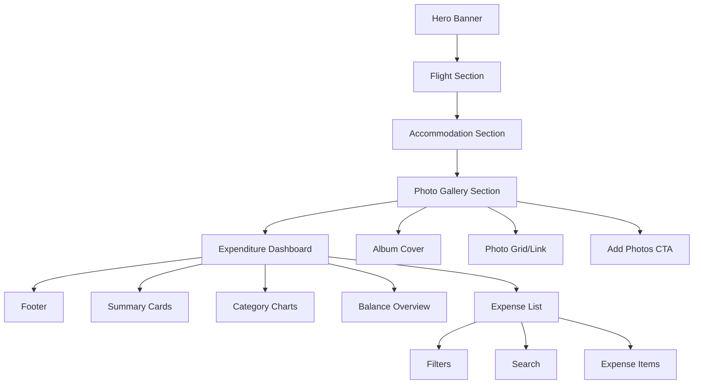
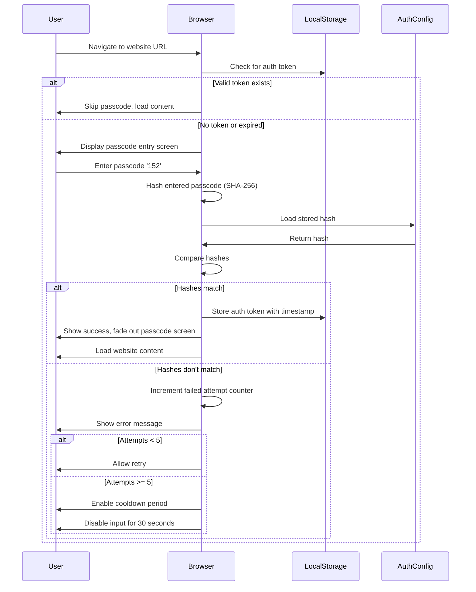
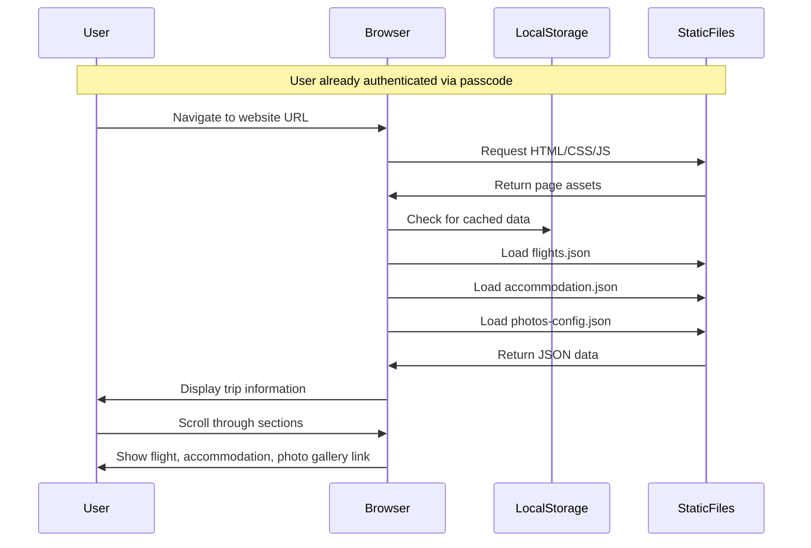
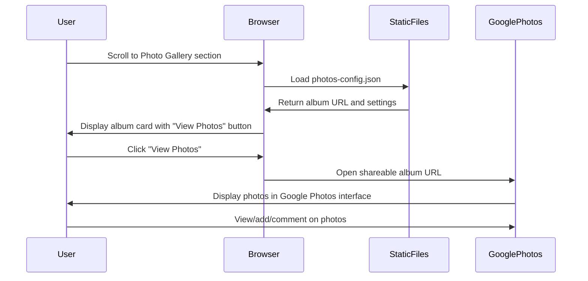
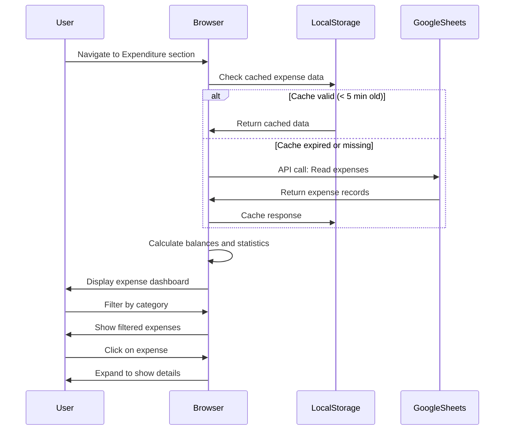
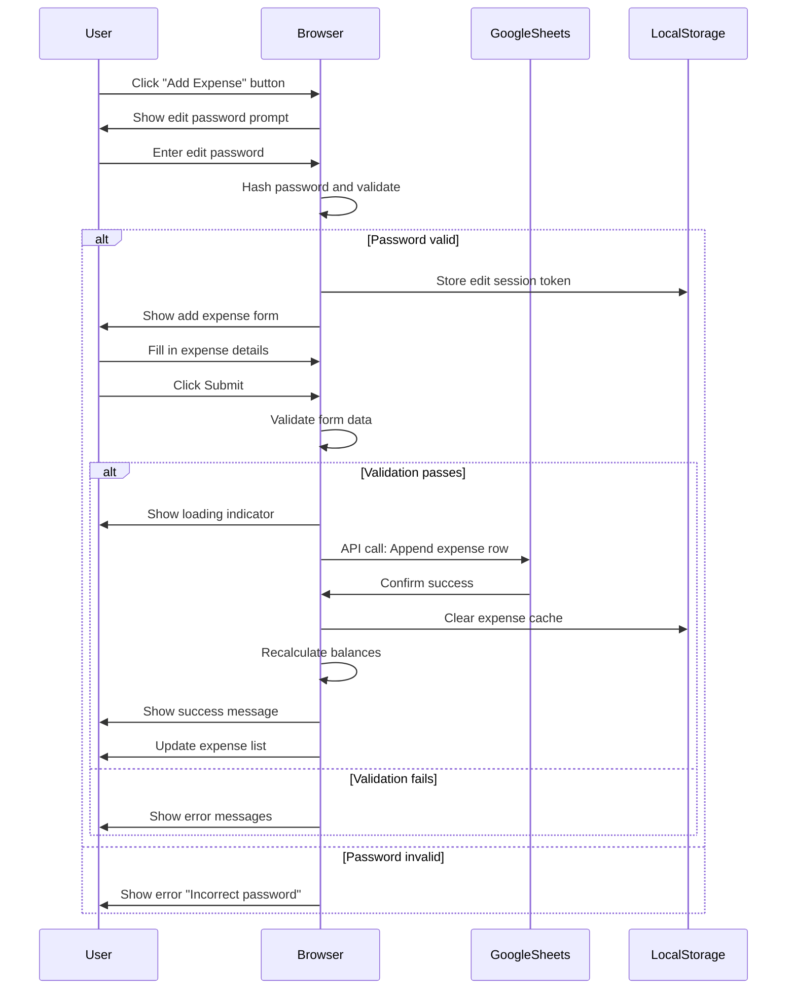
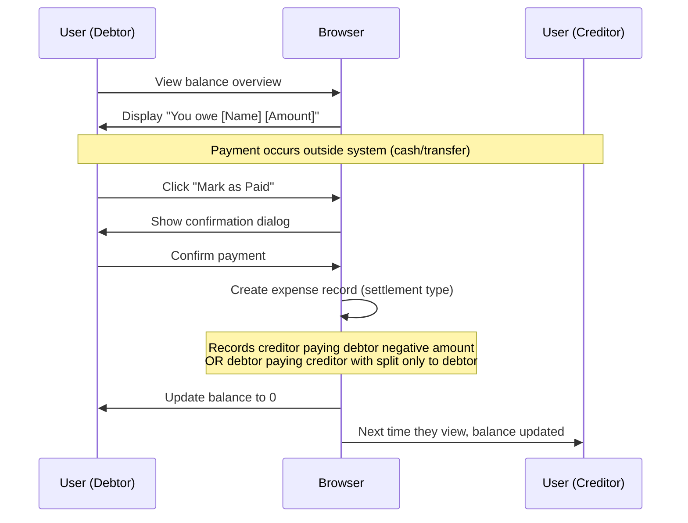
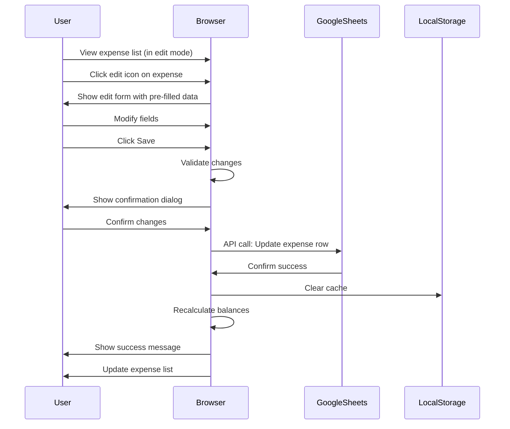

# Phuket Trip Planner Website Design

## Project Overview

### Purpose
A static website to provide trip information and expenditure tracking for a group traveling to Phuket from January 7-11, 2026. The site will be deployed on GitHub Pages and feature a beach-themed design.

### Key Features
- Flight information display (outbound and inbound)
- Accommodation details
- Expenditure tracking with per-person splits and category breakdowns
- Photo gallery connected to Google Photos shared album
- Password-protected editing capabilities
- Mobile-first responsive design optimized for smartphones
- Phuket beach-inspired color scheme

### Target Users
Group members participating in the Phuket trip who need to:
- Access the website with a passcode (Password: '152', stored as hash)
- View trip logistics (flights, accommodation) primarily on mobile devices
- Track shared expenses on-the-go from their smartphones
- Understand their financial obligations
- See who paid for what and how costs are split
- Share and view trip photos in a centralized gallery

**Primary Device**: Mobile phones (iOS and Android)
**Secondary Device**: Tablets and desktops

## System Architecture

### Deployment Model



### Storage Strategy

| Data Type | Storage Method | Rationale |
|-----------|----------------|----------|
| Flight Information | Static JSON file in repository | Read-only data, infrequent changes |
| Accommodation Details | Static JSON file in repository | Read-only data, infrequent changes |
| Trip Photos | Google Photos Shared Album via API | Centralized photo storage, easy upload from mobile devices |
| Expenditure Records | Google Sheets via API | Real-time updates, shared across users, password-protected |
| User Preferences | Browser LocalStorage | UI state, theme preferences, authentication tokens |

## Information Architecture

### Page Structure
Single-page application with scrollable sections:

1. **Hero Section**: Trip title, dates, destination image
2. **Flight Information Section**: Outbound and inbound flight cards
3. **Accommodation Section**: Hotel/lodging details
4. **Photo Gallery Section**: Google Photos shared album integration
5. **Expenditure Dashboard**: Interactive expense tracking interface
6. **Footer**: Quick actions and export options

### Navigation Flow



## Data Models

### Google Photos Album Data

| Field | Type | Description | Example |
|-------|------|-------------|----------|
| album_id | String | Unique identifier for the album | "ABC123XYZ" |
| title | String | Album title | "Phuket Trip Jan 2026" |
| shareable_url | String | Public URL to shared album | "https://photos.app.goo.gl/..." |
| share_token | String | Token for API access | "TOKEN123" |
| media_items_count | Integer | Number of photos in album | 45 |
| cover_photo_base_url | String | URL to cover photo | "https://lh3.googleusercontent.com/..." |

**Integration Approach**:

Since the Google Photos Library API has limitations for static websites (requires OAuth and only accesses app-created content as of March 2025), the recommended approach is:

**Option 1: Shareable Link Embed (Simplest)**
- Create a shared Google Photos album
- Enable link sharing in Google Photos
- Embed the shareable URL as an iframe or provide a direct link
- No API integration required
- Users click to view photos in Google Photos interface

**Option 2: Google Photos Picker API (Recommended for Static Sites)**
- Use the Google Photos Picker API introduced in 2024
- Allows users to securely select and display photos from their Google Photos
- Requires minimal authentication
- Better user experience with in-page photo display

**Option 3: Custom Photo Scraper (Advanced)**
- Parse the public shared album HTML page
- Extract photo URLs from the page structure
- Display photos in custom gallery layout
- Note: This is a workaround and may break if Google changes their HTML structure
- Recommended only if custom gallery UI is essential

### Photo Gallery Display Data

| Field | Type | Description | Example |
|-------|------|-------------|----------|
| photo_id | String | Unique identifier | "PHOTO001" |
| thumbnail_url | String | URL for thumbnail display | "https://...=w300-h300" |
| full_url | String | URL for full-size image | "https://...=w2048-h1536" |
| upload_date | ISO DateTime | When photo was added | "2026-01-08T14:30:00" |
| caption | String | Photo description (optional) | "Sunset at Patong Beach" |
| uploaded_by | String | Person who added photo | "John" |

### Flight Information

| Field | Type | Description | Example |
|-------|------|-------------|----------|
| flight_type | String | Outbound or Inbound | "Outbound" |
| flight_number | String | Airline and flight code | "UO724" |
| airline | String | Airline name | "HK Express" |
| departure_airport | String | Origin airport code and name | "HKG - Hong Kong International" |
| arrival_airport | String | Destination airport code | "HKT - Phuket International" |
| departure_datetime | ISO DateTime | Departure date and time | "2026-01-07T07:25:00" |
| arrival_datetime | ISO DateTime | Arrival date and time | "2026-01-07T10:15:00" |
| terminal | String | Terminal information | "Terminal 1" |
| gate | String | Gate number (if available) | "TBA" |
| baggage_allowance | String | Baggage information | "20KG check-in + 1 hand carry" |
| notes | String | Additional information | "Check-in opens 3 hours before" |

**Actual Trip Data**:

**Outbound Flight**:
- Flight Number: UO724
- Airline: HK Express
- Route: HKG (Hong Kong) → HKT (Phuket)
- Departure: 7 January 2026, 07:25
- Arrival: 7 January 2026, 10:15
- Duration: Approximately 2 hours 50 minutes
- Baggage: 1 × 20KG checked bag + 1 hand carry small item per person

**Inbound Flight**:
- Flight Number: UO725
- Airline: HK Express
- Route: HKT (Phuket) → HKG (Hong Kong)
- Departure: 11 January 2026, 11:10
- Arrival: 11 January 2026, 15:40
- Duration: Approximately 2 hours 30 minutes (accounting for timezone)
- Baggage: 1 × 20KG checked bag + 1 hand carry small item per person

### Accommodation Details

| Field | Type | Description | Example |
|-------|------|-------------|----------|
| property_name | String | Hotel/resort name | "The Teak Phuket Phase 2" |
| address | String | Full address | "Phuket, Thailand" |
| check_in_date | Date | Check-in date | "2026-01-07" |
| check_in_time | Time | Check-in time | "14:00" |
| check_out_date | Date | Check-out date | "2026-01-11" |
| check_out_time | Time | Check-out time | "12:00" |
| room_type | String | Type of room booked | "TBA" |
| room_count | Integer | Number of rooms | TBA |
| booking_reference | String | Confirmation code | "TBA" |
| contact_phone | String | Hotel contact number | "TBA" |
| amenities | Array of Strings | Available facilities | ["Pool", "WiFi", etc.] |
| notes | String | Special requests or info | "" |

**Actual Trip Data**:

**Accommodation**:
- Property Name: The Teak Phuket Phase 2
- Check-in: 7 January 2026 (arrival day, after 10:15 flight landing)
- Check-out: 11 January 2026 (departure day, before 11:10 flight)
- Duration: 4 nights (7-11 January 2026)
- Location: Phuket, Thailand

*Note: Additional details such as specific address, room configuration, booking reference, and amenities should be added to the static data file once confirmed.*

### Expenditure Record

| Field | Type | Description | Example |
|-------|------|-------------|----------|
| expense_id | String | Unique identifier | "EXP-001" |
| timestamp | ISO DateTime | When expense was recorded | "2026-01-07T12:30:00" |
| date | Date | Date of actual expense | "2026-01-07" |
| description | String | What was purchased | "Lunch at Seafood Restaurant" |
| category | Enum | Expense type | "Food" |
| total_amount | Decimal | Total cost in currency | 1200.00 |
| currency | String | Currency code (HKD or THB) | "THB" |
| paid_by | String | Person who paid | "John" |
| split_among | Array of Strings | People sharing the cost | ["John", "Jane", "Bob", "Alice"] |
| split_type | Enum | How to divide cost | "Equal" or "Custom" |
| custom_splits | Object | Custom amount per person | {"John": 400, "Jane": 300} |
| receipt_url | String | Link to receipt image (optional) | "https://..." |
| notes | String | Additional details | "Tip included" |

**Multi-Currency Handling**:

The system supports two currencies for this trip:
- **HKD (Hong Kong Dollar)**: Used for Hong Kong-based expenses (flights, pre-trip purchases)
- **THB (Thai Baht)**: Used for expenses in Phuket

**Display Strategy**: All totals, balances, and settlements are displayed in BOTH currencies separately
- No currency conversion or base currency concept for display purposes
- Each currency maintains its own totals and calculations
- Users see separate amounts for HKD and THB side-by-side

**Exchange Rate**:
- Optional: Configure reference exchange rate for informational purposes only: 1 HKD = ~4.5 THB
- Exchange rate is NOT used for balance calculations
- Can be displayed as reference information if helpful

### Expense Categories

| Category | Description | Icon Suggestion |
|----------|-------------|----------------|
| Food | Meals, restaurants, groceries | Utensils |
| Transport | Taxis, car rentals, fuel | Car |
| Activities | Tours, excursions, entertainment | Ticket |
| Accommodation | Hotel, lodging costs | Bed |
| Shopping | Souvenirs, personal items | Shopping bag |
| Other | Miscellaneous expenses | Tag |

### Person Profile

| Field | Type | Description | Example |
|-------|------|-------------|----------|
| person_id | String | Unique identifier | "P001" |
| display_name | String | Name shown in UI | "John" |
| total_paid_thb | Decimal | Total amount paid in THB | 5000.00 |
| total_paid_hkd | Decimal | Total amount paid in HKD | 1000.00 |
| total_owed_thb | Decimal | Total share owed in THB | 4500.00 |
| total_owed_hkd | Decimal | Total share owed in HKD | 800.00 |
| balance_thb | Decimal | Net balance in THB (positive = owed to them) | 500.00 |
| balance_hkd | Decimal | Net balance in HKD (positive = owed to them) | 200.00 |

**Note**: Each currency is tracked completely separately. A person may have a positive balance in THB but negative balance in HKD, or vice versa.

### Currency Configuration

| Field | Type | Description | Example |
|-------|------|-------------|----------|
| supported_currencies | Array | List of accepted currencies | ["THB", "HKD"] |
| reference_exchange_rate | Decimal | Optional reference rate for information only | 4.5 |
| display_mode | String | How to show dual currencies | "side_by_side" |

## Functional Requirements

### Website Access Control

**Purpose**: Restrict website access to authorized group members only

**Behavior**:
- On initial page load, display passcode entry screen
- Entire website content is hidden until correct passcode is entered
- Passcode: '152' (stored as SHA-256 hash in configuration)
- After successful authentication, store session token in LocalStorage
- Session persists until browser is closed or user manually logs out
- Optional: Session expires after configurable period (e.g., 24 hours, 7 days, or never)

**Passcode Entry Screen**:
- Clean, minimal design matching beach theme
- Trip title and subtitle: "Phuket Trip - Jan 7-11, 2026"
- Background: Beach-themed image with overlay
- Centered card with:
  - "Enter Passcode" heading
  - Numeric input field (password type to hide digits)
  - "Access Website" button
  - Error message display area
- Input validation: Numbers only
- Enter key triggers submission

**Authentication Process**:
1. User enters passcode
2. Hash the entered passcode using SHA-256
3. Compare hash with stored hash value
4. If match:
   - Store authentication token in LocalStorage
   - Fade out passcode screen
   - Load and display main website content
   - Show success notification (optional)
5. If no match:
   - Display error: "Incorrect passcode. Please try again."
   - Clear input field
   - Increment failed attempt counter
   - After 5 failed attempts: Add 30-second cooldown
   - After 10 failed attempts: Add 5-minute cooldown

**Session Management**:
- Check for valid session token on every page load
- Token structure: { passcode_hash, timestamp, expiry_date }
- If valid token exists: Skip passcode screen, load content directly
- If no token or expired: Show passcode screen
- "Logout" option in footer (clears session token)

**Security Considerations**:
- Passcode hash stored in static configuration file (photos-config.json or separate auth-config.json)
- SHA-256 hash of '152': `9f6e6800cfae7749eb6c486619254b9f56a9056798609c0edc2aa947c2fea05b`
- Client-side authentication (limitation of static site)
- Not truly secure but provides basic access control
- Sufficient for non-sensitive trip coordination data
- Note: Anyone inspecting source code can find hash and potentially brute force

**Configuration Storage** (auth-config.json or within existing config):
```
{
  "access_passcode_hash": "9f6e6800cfae7749eb6c486619254b9f56a9056798609c0edc2aa947c2fea05b",
  "session_expiry_hours": 168,
  "max_failed_attempts": 5,
  "cooldown_seconds": 30,
  "edit_password_hash": "[separate hash for editing expenses]",
  "supported_currencies": ["THB", "HKD"],
  "reference_exchange_rate_hkd_to_thb": 4.5
}
```
Note: access_passcode_hash is for website access, edit_password_hash is for expense editing (different passwords)

**Edge Cases**:
- Browser doesn't support LocalStorage: Session per tab only
- User clears browser data: Must re-enter passcode
- Multiple tabs: Authentication shared via LocalStorage
- Incognito mode: Must enter passcode each session

**User Experience**:
- Remember to share passcode '152' with all group members via secure channel
- First-time users: Clear instructions on passcode entry
- Returning users: Automatic authentication if session valid
- Mobile-friendly passcode input with numeric keyboard

### Flight Information Display

**Purpose**: Present flight details in an easily scannable format

**Behavior**:
- Display two cards: one for outbound flight, one for inbound flight
- Each card shows airline logo (if available), flight number, route, and timing
- Display duration calculated from departure and arrival times
- Show countdown to departure for outbound flight when within 7 days
- Use timezone-aware datetime handling
- Provide visual timeline showing departure and arrival

**Interactions**:
- Cards are read-only
- Clicking on flight number could copy to clipboard
- Option to add flight to calendar (export .ics file)

### Accommodation Information Display

**Purpose**: Provide quick access to lodging details

**Behavior**:
- Display property name, address with map link
- Show check-in/check-out dates and times prominently
- List amenities as tags or icons
- Display booking reference in copy-friendly format
- Show countdown to check-in when within 7 days

**Interactions**:
- Address links to Google Maps
- Phone number is clickable (tel: link)
- Booking reference has copy-to-clipboard button
- Amenities are displayed as visual badges

### Photo Gallery Display

**Purpose**: Showcase trip photos from a shared Google Photos album

**Behavior**:

**Implementation Strategy** (Choose one based on requirements):

**Recommended: Shareable Link Integration**
- Display a prominent "View Photo Gallery" button/card
- Button links to the shared Google Photos album URL
- Shows album cover photo and photo count
- Users view photos in native Google Photos interface
- No API complexity or authentication needed
- Group members can add photos directly in Google Photos app

**Alternative: Embedded Gallery**
- Embed Google Photos album as iframe within the page
- Set iframe dimensions to fit within page section
- Responsive sizing for mobile devices
- Users can browse photos without leaving the website
- Limited customization of appearance

**Advanced: Custom Gallery UI**
- Use Google Photos Picker API or custom scraper
- Display photos in masonry or grid layout
- Lightbox modal for full-size viewing
- Lazy loading for performance
- Filter by date or person (if metadata available)
- Show photo count and upload dates

**Interactions**:
- Click photo to open full-size view or lightbox
- Navigate with arrow keys or swipe gestures
- "Add Photos" button redirects to Google Photos album
- "Share Album" button copies shareable link
- Refresh button to load newly added photos

### Expenditure Dashboard

**Purpose**: Track and visualize group expenses with transparent split calculations

#### View Mode (Default)

**Summary Panel**:
- Total trip expenses (all categories combined)
  - Display BOTH currencies separately:
    - "Total THB: 25,000 THB"
    - "Total HKD: 8,000 HKD"
  - Side-by-side display on desktop, stacked on mobile
  - Each currency has its own total card or section
  - Optional: Show reference conversion as supplementary info (e.g., "≈ 61,000 THB equivalent at 4.5 rate")
- Per-person balance overview showing who owes whom (separate for each currency)
  - Example: "John: +500 THB, +200 HKD"
- Category breakdown with percentage distribution (calculated per currency)
  - Food: 40% of THB expenses, 30% of HKD expenses
- Visual indicators for settlement status
- Currency split showing total in each currency (not percentage, but actual amounts)

**Expense List**:
- Chronological list of all expenses
- Each entry shows: date, description, amount in original currency, paid by, split among
  - Display: "1,200 THB" or "500 HKD" (no conversion shown)
- Filter by category, date range, person, or currency
- Sort by date, amount (within same currency), or category
- Search functionality for description text
- Currency indicator badge on each expense item (THB badge or HKD badge)

**Balance Calculations**:
- For each person, calculate separately for EACH currency:
  - Total amount paid in THB (sum of THB expenses they paid for)
  - Total amount paid in HKD (sum of HKD expenses they paid for)
  - Total share owed in THB (sum of their portion of all THB split expenses)
  - Total share owed in HKD (sum of their portion of all HKD split expenses)
  - Net balance in THB (THB amount paid minus THB amount owed)
  - Net balance in HKD (HKD amount paid minus HKD amount owed)
- Display settlement suggestions separately for each currency:
  - "Alice owes Bob 500 THB"
  - "Alice owes Bob 200 HKD"
  - These are two separate transactions, not combined
- Show percentage of total expenses each person paid (calculated per currency)
  - "John paid 40% of total THB expenses"
  - "John paid 25% of total HKD expenses"
- Show percentage of total expenses each person owes (calculated per currency)
- Optional: Show detailed breakdown by currency for each person in expandable view

**Visualizations**:
- Pie chart showing category distribution (separate charts for THB and HKD, or stacked view)
  - "Category Distribution - THB Expenses"
  - "Category Distribution - HKD Expenses"
- Bar chart comparing per-person spending (separate bars or grouped bars for each currency)
  - Each person has two bars: one for THB, one for HKD
- Currency comparison: Bar chart or cards showing total spent in each currency
  - "Total: 25,000 THB | 8,000 HKD"
- Timeline view of expenses by date (color-coded by currency: THB vs HKD)
- Progress indicator showing percentage of budget used if budget set (separate for each currency)

#### Edit Mode (Password-Protected)

**Authentication**:
- Clicking "Edit" or "Add Expense" button triggers password prompt
- Password is validated against a hashed value stored in configuration
- Failed attempts show error message after 3 tries, implement temporary lockout
- Successful authentication stores session token in LocalStorage
- Auto-logout after 30 minutes of inactivity

**Add Expense**:
- Modal or slide-in form with fields:
  - Description (required, text input)
  - Amount (required, numeric input)
  - Currency (required, dropdown: THB or HKD)
  - Category (required, dropdown selection)
  - Date (required, date picker, defaults to today)
  - Paid by (required, dropdown of group members)
  - Split among (required, multi-select checkboxes, defaults to all)
  - Split type (equal or custom, radio buttons)
  - Custom split amounts (if custom selected, input per person, in same currency as expense)
  - Notes (optional, text area)
  - Receipt upload (optional, file input)
- Form validation:
  - Amount must be positive number
  - Currency must be THB or HKD
  - Custom splits must sum to total amount (in original currency)
  - At least one person must be selected for split
  - Paid by must be one of the group members
- No conversion calculation displayed (each currency stands alone)
- Submit button writes to Google Sheets with amount in original currency only
- Success/error feedback with toast notifications

**Edit Expense**:
- Click on expense entry to open edit modal
- Pre-populate form with existing data
- Allow modification of all fields except expense_id
- Update timestamp when saved
- Confirmation prompt before saving changes

**Delete Expense**:
- Delete icon/button on each expense entry
- Confirmation dialog: "Are you sure you want to delete this expense?"
- Soft delete option (mark as deleted rather than remove from sheet)
- Success feedback after deletion

**Validation Rules**:
- Prevent duplicate submissions (disable button after click)
- Currency amounts rounded to 2 decimal places
- Date cannot be in the future
- Split amounts must match total (for custom splits)

### Google Sheets Integration

**Purpose**: Use Google Sheets as a backend database for expenditure data

**Setup Requirements**:
- Create Google Cloud project with Sheets API enabled
- Generate API key and OAuth 2.0 credentials
- Configure authorized JavaScript origins for GitHub Pages domain
- Create dedicated spreadsheet with structured columns matching data model

**Sheet Structure**:

Worksheet 1: Expenses
- Columns match Expenditure Record data model fields
- Each row represents one expense
- First row contains header labels

Worksheet 2: People
- Columns: person_id, display_name, email (optional)
- Maintains list of group members

Worksheet 3: Configuration
- Key-value pairs for settings
- Password hash, currency, budget limit, etc.

**API Operations**:

| Operation | Sheet Method | Purpose |
|-----------|-------------|----------|
| Load Expenses | Read range A2:O | Fetch all expense records on page load |
| Add Expense | Append row | Insert new expense record |
| Update Expense | Update range | Modify existing expense record |
| Delete Expense | Update cell | Mark expense as deleted or remove row |
| Load People | Read range | Fetch group member list |
| Load Config | Read range | Fetch settings and hashed password |

**Error Handling**:
- Display user-friendly error messages for API failures
- Implement retry logic with exponential backoff
- Cache data in LocalStorage as fallback
- Show offline indicator when API unavailable
- Provide option to export/import data as CSV backup

**Performance Optimization**:
- Batch read operations on initial load
- Cache API responses in LocalStorage with timestamp
- Only fetch updates since last sync (timestamp-based)
- Debounce rapid edit operations
- Show loading indicators during API calls

## User Interface Design

### Visual Theme: Phuket Beach

**Color Palette**:

| Color Name | Hex Code | Usage |
|------------|----------|-------|
| Turquoise Blue | #1AB5C4 | Primary actions, headers, links |
| Sandy Beige | #F4E8D0 | Background, light sections |
| Sunset Orange | #FF8C42 | Accent, important buttons, alerts |
| Ocean Deep | #0A4D68 | Text, dark elements, navigation |
| Sky Light | #E8F6F7 | Cards, input backgrounds |
| Palm Green | #88AB75 | Success states, category tags |
| White | #FFFFFF | Content backgrounds, text on dark |
| Coral Pink | #FFB6C1 | Secondary accents, highlights |

**Typography**:
- Headings: Sans-serif, bold, clean (suggest: Poppins or Montserrat)
- Body text: Sans-serif, regular, readable (suggest: Open Sans or Roboto)
- Numbers/Amounts: Monospace or tabular figures for alignment

**Design Principles**:
- Mobile-first approach: Design for mobile screens first, then scale up
- Vertical scrolling optimized for thumb navigation
- Large, touch-friendly tap targets (minimum 48px × 48px)
- Single-column layout on mobile for optimal readability
- Reduced cognitive load: Show essential info first, details on expand
- Fast loading: Optimize images and minimize JavaScript
- Offline-capable: Cache critical data for flaky mobile connections
- Bottom navigation or sticky actions for thumb-reach ergonomics
- Minimize text input: Use dropdowns, date pickers, and number steppers
- One-hand usability: Key actions reachable with thumb
- Card-based design for distinct content sections
- Rounded corners for softer, beach-like feel
- Subtle wave or beach imagery in backgrounds
- Progressive disclosure: Hide advanced features until needed
- Swipe gestures for common actions (delete, edit)

### Layout Structure



### Component Specifications

#### Hero Section
- Full-width background image (Phuket beach scene)
- Centered text overlay: Trip title, dates, location
- Subtle gradient overlay for text readability
- Scroll indicator or down arrow
- **Mobile**: Height 50-60vh (fits in one screen), larger text for readability
- **Desktop**: Height 60-70vh
- Optional: Small "Logout" link in top-right corner
- Touch-optimized scroll indicator (large, animated)

#### Passcode Entry Screen

**Layout**:
- Full-screen overlay covering entire page
- Beach background image (same as hero or similar)
- Semi-transparent dark overlay for contrast
- Centered authentication card

**Card Design**:
- White or light sky blue background
- Rounded corners (12-16px border-radius)
- Box shadow for depth
- Padding: 40px on desktop, 24px on mobile
- Max-width: 400px
- Vertically and horizontally centered

**Card Contents**:
- Trip logo or icon (optional)
- Heading: "Phuket Trip 2026" (Ocean Deep color, font-size: 28px mobile)
- Subheading: "January 7-11" (lighter text, font-size: 18px mobile)
- Divider line
- Label: "Enter Passcode" (font-size: 16px)
- Input field:
  - Type: password (displays dots/asterisks)
  - Pattern: numbers only (triggers numeric keyboard on mobile)
  - Placeholder: "•••"
  - Large, centered text
  - Border: 2px solid, Ocean Deep when focused
  - Padding: 18px (extra padding for touch)
  - Font-size: 32px (large for easy viewing)
  - Width: 100%
  - **Mobile-specific**: inputmode="numeric" to trigger number pad
- Submit button:
  - Full width
  - Turquoise Blue background
  - White text
  - Padding: 18px (48px minimum height for touch)
  - Margin-top: 20px
  - Rounded corners (8px)
  - Font-size: 18px
  - Label: "Access Website"
  - **Mobile**: Slightly larger for thumb-friendly tapping
- Error message area:
  - Red text (Sunset Orange)
  - Below button
  - Hidden by default
  - Fade in on error
  - Font-size: 14px
- Helper text: "Contact trip organizer if you need the passcode" (small, gray, 12px)

**Interaction States**:
- Input focus: Blue border, subtle glow
- Button hover: Slight darken
- Button disabled: Gray, "Please wait..." during cooldown
- Error state: Input border turns red, shake animation
- Success state: Green checkmark animation, fade out card

#### Flight Card
- White card with subtle shadow
- Airline logo on left (scaled for mobile readability)
- Flight details in center: route, times, duration
- Gate/terminal info below main details (stacked vertically on mobile)
- Status indicator (upcoming/completed) with color coding
- **Mobile layout**: Full-width card, single column, larger font sizes
  - Flight number: 20px bold
  - Route: 18px
  - Time details: 16px
  - Padding: 20px
  - Margin between cards: 16px
- **Desktop**: Two-column layout within card
- Touch area: Entire card tappable to expand for full details
- Copy-to-clipboard icons for flight number (48px touch target)

#### Accommodation Card
- Similar styling to flight card
- Property image or icon (optimized for mobile loading)
- Key details prominently displayed
- Action buttons: View on Map, Call, Copy Booking Reference
  - **Mobile**: Stacked vertically, full-width buttons (48px height each)
  - Icon + text labels for clarity
  - Direct tel: link for instant calling on mobile
  - One-tap to open maps app
- Collapsible amenities section (accordion style)
- **Mobile optimization**:
  - Font-size: 18px for property name
  - Font-size: 16px for details
  - Generous padding: 20px
  - Clear visual hierarchy

#### Photo Gallery Section

**Simple Link Approach (Recommended)**:
- Large card with album cover photo as background
- Overlay text: "Trip Photos" or "View Gallery"
- Photo count display: "45 photos"
- Call-to-action button: "Open Album" or "View Photos" (48px height, full-width on mobile)
- Secondary button: "Add Photos" (opens album in edit mode)
- Styled in theme colors with beach imagery
- **Mobile optimized**: 
  - Card height: 200px minimum for easy tapping
  - Large, readable text (24px for title)
  - Touch-optimized buttons with clear spacing (12px gap)

**Embedded Gallery Approach**:
- Full-width iframe container
- **Mobile**: Height 400px (optimized for portrait viewing)
- **Desktop**: Height 600px
- Responsive iframe scaling
- Loading spinner while iframe loads (prevents blank screen)
- Fallback link if iframe fails to load
- Pinch-to-zoom support for photos

**Custom Gallery UI Approach**:
- Masonry grid layout
  - **Mobile**: 2 columns (optimized for thumb scrolling)
  - **Tablet**: 3 columns
  - **Desktop**: 4 columns
- Photo thumbnails with aspect ratio preserved (square crops for consistency)
- Large touch targets: 160px minimum per photo on mobile
- Hover effect on desktop, tap highlight on mobile
- Click/tap opens lightbox modal
- Lightbox features:
  - Full-screen photo display
  - Navigation arrows (large 60px touch targets on mobile)
  - Close button (top-right, 48px × 48px)
  - Photo counter: "3 of 45" (large, readable text)
  - Swipe gestures on mobile (natural photo browsing)
  - Pinch-to-zoom support
  - Double-tap to zoom
- **Mobile-specific**: Virtual scrolling for performance (load 20 photos at a time)
- "Load More" button (48px height) or infinite scroll
- Skeleton loaders while photos fetch (improves perceived performance)

#### Expenditure Summary Cards

Row of 3-4 metric cards:
1. **Total Expenses**: Display BOTH currencies prominently:
   - Card 1: "25,000 THB Total"
   - Card 2: "8,000 HKD Total"
   - Or combined card with two rows:
     - "THB: 25,000"
     - "HKD: 8,000"
2. **Per Person Average**: Calculated separately for each currency
   - "THB: 6,250 per person"
   - "HKD: 2,000 per person"
3. **Pending Settlements**: Number of outstanding balances, alert icon if any
   - Shows count of people who owe/are owed in either currency
4. **Most Expensive Category**: Shown separately for each currency or combined
   - "Food: 10,000 THB (40%)"
   - "Transport: 3,000 HKD (37.5%)"

Each card:
- Gradient background (from color palette)
- White text
- Icon on top for mobile (left on desktop)
- Number prominently displayed (32px font on mobile)
- **Mobile**: 
  - 2x2 grid layout (2 cards per row)
  - Card height: 120px minimum
  - Padding: 16px
  - Font-size: 24px for numbers, 14px for labels
  - Tap to expand for more details
- **Desktop**: Single row layout

**Currency Display Format**:
- Each currency shown in its own value (no conversion)
- Clear currency labels: "THB" or "HKD" prominently displayed
- Example: 
  - "25,000 THB" (not converted)
  - "8,000 HKD" (not converted)
- Optional reference info (small text): "Reference: ≈ 61,000 THB equivalent" if helpful

#### Balance Overview Table

| Person | Paid THB | Owes THB | Balance THB | Paid HKD | Owes HKD | Balance HKD | Status |
|--------|----------|----------|-------------|----------|----------|-------------|--------|
| Visual representation with color coding for each currency |

- Green highlight for positive balance (owed to them) in that currency
- Orange highlight for negative balance (they owe) in that currency
- Neutral for zero balance (settled) in that currency
- Amounts shown with currency symbol
- Percentage values displayed next to amounts (calculated per currency)
- Settlement suggestions below table (separate for each currency):
  - "THB Settlements: Alice owes Bob 500 THB"
  - "HKD Settlements: John owes Alice 200 HKD"
- **Mobile optimization**:
  - Horizontal scroll enabled if table too wide
  - Or: Card-based layout instead of table (recommended for mobile)
    - One card per person (full width)
    - Two sections in card: THB balances and HKD balances
    - Large font: 18px for name, 24px for balance
    - Color-coded background gradient per currency
    - Tap to see detailed breakdown
  - Sticky header row when scrolling
  - Font-size: 14px minimum for table text
  - Adequate row height: 56px minimum for touch

**Example Display (Card Format for Mobile)**:
```
[John's Card]
THB: Paid 5,000 | Owes 4,500 | Balance: +500 ✓
HKD: Paid 1,000 | Owes 800 | Balance: +200 ✓
[Status: Owed money in both currencies]
```

#### Expense List Item

Each expense displayed as:
```
[Currency Badge: THB/HKD] [Category Icon] Description
Amount: 1,200 THB  OR  Amount: 500 HKD
Paid by Name | Split among: Name1, Name2, Name3
Date | Category Tag | Edit/Delete buttons (if in edit mode)
```

- Alternating row colors for readability
- Currency badge: Small colored tag (different color for HKD vs THB)
- Amount display: Show in original currency only (no conversion)
- **Mobile optimization**:
  - Full-width cards with generous padding (16px)
  - Stacked layout: Each line on separate row for clarity
  - Font-size: 16px for description, 18px for amount (bold)
  - Line-height: 1.5 for readability
  - Minimum card height: 100px
  - Clear separation between cards (12px gap)
  - Swipe left to reveal edit/delete actions (iOS/Android native pattern)
  - Swipe right to mark as viewed
  - Tap anywhere on card to expand for full details
- Hover effect on desktop, tap highlight on mobile (subtle background color change)
- Click/tap to expand: show notes, receipt thumbnail, detailed split breakdown (in original currency)
  - Expansion animates smoothly (0.3s ease)
  - Expanded state shows all details with comfortable spacing
- Touch feedback: Ripple effect on tap (Material Design pattern)

#### Forms and Inputs

- Input fields: White background, border in Ocean Deep color
- Focus state: Border changes to Turquoise Blue, subtle shadow
- Labels: Above input, small text in Ocean Deep
- **Mobile-optimized inputs**:
  - Height: 48px minimum for touch
  - Font-size: 16px (prevents auto-zoom on iOS)
  - Padding: 12px horizontal, 14px vertical
  - Appropriate input types:
    - `type="number"` with `inputmode="decimal"` for amounts
    - `type="tel"` or `inputmode="numeric"` for passcode
    - `type="date"` for native date picker on mobile
  - Clear "X" button for text inputs
  - Touch-optimized dropdown selectors
- Dropdowns: 
  - Custom styled to match theme
  - Native select on mobile (better UX)
  - Large touch targets (full input height)
  - Bottom sheet style for multi-option selects on mobile
- Checkboxes/Radio: 
  - Custom icons in theme colors
  - Minimum 48px × 48px touch target (include label)
  - Visual feedback on selection
- Buttons:
  - Primary: Turquoise Blue background, white text, rounded (8px)
    - Height: 48px minimum
    - Font-size: 16px
    - Full-width on mobile
  - Secondary: Outlined with Turquoise Blue, transparent background
    - Same sizing as primary
  - Danger: Sunset Orange background, white text
  - Disabled: Gray, reduced opacity (0.5)
  - Active state: Slight scale down (0.98)
  - Loading state: Spinner animation, button disabled
- Form validation errors: 
  - Red text below input (14px)
  - Icon indicator
  - Shake animation on error
  - Auto-scroll to first error field
- Date pickers:
  - Native mobile date picker (best UX)
  - Custom calendar on desktop
  - Touch-friendly day selection (48px minimum)
- Number steppers:
  - Large +/- buttons (48px) for amount adjustment
  - Direct input still available
  - Haptic feedback on increment/decrement (if supported)

#### Charts and Visualizations

- Pie chart: Use color palette for category slices
- Bar chart: Turquoise Blue bars with hover effects
- Legend: Clear labels with colored squares
- Tooltips on hover/tap: White card with amount and percentage details
- **Mobile optimization**:
  - Responsive chart sizing: Full-width on mobile
  - Minimum height: 250px on mobile for readability
  - Large touch targets for interactive elements
  - Tap to highlight chart segments (not hover)
  - Larger font sizes for labels (14px minimum)
  - Simplified legends on mobile (icons only, full text on tap)
  - Horizontal scrolling for wide bar charts if needed
  - Chart libraries: Use mobile-optimized options (e.g., Chart.js with responsive: true)
- Loading state: Skeleton loader or spinner matching theme colors
- Empty state: Clear messaging with illustration if no data

### Responsive Breakpoints

| Breakpoint | Screen Width | Layout Adjustments | Priority |
|------------|--------------|--------------------|---------|
| Mobile (Primary) | < 640px | Single column, stacked cards, thumb-optimized navigation, full-width components | **HIGH - Primary Target** |
| Tablet | 640px - 1024px | Two columns where appropriate, larger touch targets | Medium |
| Desktop | > 1024px | Multi-column layout, sidebar possible, hover states | Low |

### Interactive States

| Element | Hover | Active | Disabled | Focus |
|---------|-------|--------|----------|-------|
| Button | Slight darken, scale 1.02 | Scale 0.98 | Gray, opacity 0.5 | Blue outline |
| Card | Subtle shadow increase | Border highlight | N/A | Blue border |
| Link | Underline, color brighten | Color darken | Gray | Blue outline |
| Input | Border color change | N/A | Gray background | Blue border, shadow |

### Animation and Transitions

- Page section reveal: Fade in with slight upward slide on scroll (subtle on mobile to preserve performance)
- Card interactions: 0.2s ease-in-out transitions
- Modal/Dialog: Fade in background, slide up from bottom on mobile (0.3s)
  - Desktop: Scale in from center
- Loading states: Pulsing or rotating spinner in theme color
- Success actions: Checkmark animation, green flash
- Error actions: Shake animation, red flash
- Data updates: Smooth number counting animation for totals
- **Mobile-specific animations**:
  - Pull-to-refresh: Standard mobile pattern with loading indicator
  - Swipe actions: Smooth reveal of buttons with spring animation
  - Page transitions: Slide animations between sections
  - Reduced motion: Respect prefers-reduced-motion user preference
  - Hardware acceleration: Use transform and opacity for 60fps performance
  - Avoid layout thrashing: Batch DOM updates

## Non-Functional Requirements

### Performance

| Metric | Target | Measurement Method |
|--------|--------|--------------------|
| Initial Page Load (Mobile) | < 3 seconds on 3G | Lighthouse performance score |
| Time to Interactive (Mobile) | < 4 seconds on 3G | Browser DevTools |
| First Contentful Paint | < 1.5 seconds | Lighthouse |
| Largest Contentful Paint | < 2.5 seconds | Core Web Vitals |
| Cumulative Layout Shift | < 0.1 | Core Web Vitals |
| First Input Delay | < 100ms | Core Web Vitals |
| API Response Display | < 1 second | After API call completion |
| Smooth Scrolling | 60 fps (mobile) | Browser performance monitor |
| Image Load | Progressive/Lazy | Intersection Observer API |
| Touch Response | < 100ms | User interaction tracking |

**Mobile-First Optimization Strategies**:
- Critical CSS inlined in HTML head for faster first paint
- Defer non-critical JavaScript loading
- Minimize and bundle CSS/JavaScript with tree-shaking
- Compress and optimize images:
  - WebP format with JPEG fallback
  - Responsive images with srcset (serve smaller images to mobile)
  - Maximum 100KB per image on mobile
  - Lazy load images below fold
- Use CDN for third-party libraries
- Implement service worker for offline capability and caching
- Cache static assets aggressively (versioned filenames)
- Minimize Google Sheets API calls through aggressive caching
- Prefetch next section content as user scrolls
- Use font-display: swap for web fonts to prevent invisible text
- Reduce third-party scripts to minimum
- **Mobile-specific**:
  - Reduce bundle size: Code-split by route if using framework
  - Preload critical resources with `<link rel="preload">`
  - Use HTTP/2 server push for critical assets
  - Minimize main thread work: Use Web Workers for heavy calculations
  - Virtual scrolling for long expense lists (render only visible items)
  - Debounce scroll and resize events
  - Optimize Google Sheets API: Fetch only changed rows
  - Request smaller image sizes for mobile devices
  - Implement skeleton screens to improve perceived performance

### Security

**Authentication**:
- Password stored as SHA-256 hash in Google Sheets config
- Client-side hashing before comparison
- Session token stored in LocalStorage with expiry
- No sensitive data in URL parameters
- Logout on browser close (optional setting)

**Data Protection**:
- HTTPS enforced via GitHub Pages
- Google Sheets API key restricted to GitHub Pages domain
- OAuth 2.0 flow for sensitive operations
- No personal financial data beyond trip expenses
- Privacy notice if collecting any identifiable information

**Input Validation**:
- Sanitize all user inputs to prevent injection
- Validate data types and ranges on client side
- Server-side validation via Google Sheets API constraints
- Rate limiting on API calls to prevent abuse

### Accessibility

| WCAG 2.1 Criteria | Implementation |
|-------------------|----------------|
| Color Contrast | Minimum 4.5:1 for normal text, 3:1 for large text, tested on mobile screens |
| Keyboard Navigation | All interactive elements focusable and operable via keyboard |
| Touch Target Size | Minimum 48px × 48px for mobile (exceeds WCAG 44px requirement) |
| Screen Reader | Semantic HTML, ARIA labels where needed, tested with mobile screen readers |
| Focus Indicators | Visible focus outlines on all interactive elements (3px solid) |
| Alt Text | Descriptive alt text for all images |
| Responsive Text | Text resizable up to 200% without loss of functionality |
| Error Identification | Clear error messages with suggestions and visual indicators |
| Orientation | Support both portrait and landscape orientations on mobile |
| Motion | Respect prefers-reduced-motion for users with vestibular disorders |

**Mobile-Specific Accessibility**:
- Use semantic HTML5 elements (nav, main, section, article)
- ARIA roles for dynamic content (role="status" for updates)
- ARIA live regions for expense updates (announce to screen readers)
- Skip-to-content link for keyboard/screen reader users
- Form labels properly associated with inputs (tap label to focus input)
- Button text descriptive of action (avoid generic "Click here")
- Table headers properly marked with scope attributes
- Sufficient color contrast tested in bright sunlight conditions
- Text does not rely solely on color for meaning
- Tap targets have adequate spacing (8px minimum between targets)
- Form inputs use appropriate input types for native mobile keyboards
- Touch gestures have alternative keyboard/button methods
- Avoid horizontal scrolling (fits in viewport width)
- Test with iOS VoiceOver and Android TalkBack screen readers

### Browser Compatibility

| Browser | Minimum Version | Notes | Priority |
|---------|----------------|-------|----------|
| Mobile Safari (iOS) | 14+ | Primary mobile browser, full support | **CRITICAL** |
| Mobile Chrome (Android) | Latest 2 versions | Primary Android browser, full support | **CRITICAL** |
| Samsung Internet | Latest version | Common on Samsung devices | **HIGH** |
| Chrome (Desktop) | 90+ | Development and desktop access | Medium |
| Firefox (Desktop) | 88+ | Desktop support | Low |
| Safari (Desktop) | 14+ | Desktop support | Low |
| Edge (Desktop) | 90+ | Chromium-based, desktop support | Low |

**Mobile-First Testing Strategy**:
- Test on real mobile devices (not just emulators)
- Test both iOS and Android platforms
- Test on various screen sizes: iPhone SE (small), standard phones, large phones
- Test in portrait and landscape orientations
- Test with slow network conditions (3G simulation)
- Test touch interactions: tap, swipe, pinch-to-zoom
- Test with mobile screen readers enabled
- Test form inputs with native mobile keyboards

**Graceful Degradation**:
- Fallback for unsupported CSS features (use @supports queries)
- Polyfills for missing JavaScript APIs (minimal, check browser support first)
- Alternative text for chart visualizations
- Basic functionality without JavaScript (static info only)
- Progressive enhancement: Core content loads first, enhancements layer on top

### Internationalization

**Currency**:
- Primary: Thai Baht (THB)
- Display format: 1,234.56 THB
- Optional conversion to home currency (configurable)
- Use Intl.NumberFormat for locale-aware formatting

**Date/Time**:
- Display in local timezone (Bangkok, GMT+7)
- Format: "7 Jan 2026, 08:30" or configurable
- ISO 8601 for storage
- Handle timezone conversions for flights

**Language**:
- Primary language: English
- Structure allows for future translation
- Date/number formatting respects locale

## Technical Considerations

### Static Site Constraints

**What GitHub Pages Provides**:
- Static HTML, CSS, JavaScript hosting
- HTTPS via github.io domain or custom domain
- Automatic deployment from repository
- CDN distribution

**What GitHub Pages Cannot Do**:
- No server-side processing
- No backend database
- No server-side authentication
- No secrets management (API keys must be public or use OAuth)

**Workarounds**:
- Use Google Sheets as pseudo-database
- Client-side authentication (password hashing)
- API keys with domain restrictions
- All business logic in JavaScript

### Build and Deployment

**Development Workflow**:
1. Local development with hot reload
2. Version control with Git
3. Testing on multiple devices/browsers
4. Build optimization (minification, bundling)
5. Commit to GitHub repository
6. Automatic deployment via GitHub Actions or Pages auto-deploy

**Repository Structure**:
```
/
├── index.html (main page)
├── assets/
│   ├── css/
│   │   └── styles.css
│   ├── js/
│   │   ├── main.js
│   │   ├── auth.js (passcode authentication logic)
│   │   ├── sheets-api.js
│   │   ├── photos-api.js (if using API integration)
│   │   └── calculations.js
│   ├── images/
│   │   └── (beach backgrounds, icons)
│   └── data/
│       ├── flights.json
│       ├── accommodation.json
│       └── photos-config.json (album URL and settings)
├── config/
│   ├── api-config.js
│   └── auth-config.json (passcode hash and settings)
└── README.md
```

**Deployment Process**:
- Push to main branch triggers deployment
- GitHub Pages serves from root or /docs folder
- Custom domain configuration (optional)
- SSL certificate automatically provisioned

### Google Sheets API Integration

**Purpose**: Use Google Sheets as a backend database for expenditure data

**Setup Requirements**:
- Create Google Cloud project with Sheets API enabled
- Generate API key and OAuth 2.0 credentials
- Configure authorized JavaScript origins for GitHub Pages domain
- Create dedicated spreadsheet with structured columns matching data model

**Sheet Structure**:

Worksheet 1: Expenses
- Columns match Expenditure Record data model fields
- Each row represents one expense
- First row contains header labels

Worksheet 2: People
- Columns: person_id, display_name, email (optional)
- Maintains list of group members

Worksheet 3: Configuration
- Key-value pairs for settings
- Password hash, currency, budget limit, etc.

**API Operations**:

| Operation | Sheet Method | Purpose |
|-----------|-------------|----------|
| Load Expenses | Read range A2:O | Fetch all expense records on page load |
| Add Expense | Append row | Insert new expense record |
| Update Expense | Update range | Modify existing expense record |
| Delete Expense | Update cell | Mark expense as deleted or remove row |
| Load People | Read range | Fetch group member list |
| Load Config | Read range | Fetch settings and hashed password |

**Error Handling**:
- Display user-friendly error messages for API failures
- Implement retry logic with exponential backoff
- Cache data in LocalStorage as fallback
- Show offline indicator when API unavailable
- Provide option to export/import data as CSV backup

**Performance Optimization**:
- Batch read operations on initial load
- Cache API responses in LocalStorage with timestamp
- Only fetch updates since last sync (timestamp-based)
- Debounce rapid edit operations
- Show loading indicators during API calls

### Google Photos Album Integration

**Purpose**: Display trip photos from a shared Google Photos album

**Setup Requirements**:

**For Simple Link/Embed Approach (Recommended)**:
1. Create a Google Photos album
2. Add initial photos (can be placeholder or first batch)
3. Click "Share" button in Google Photos
4. Enable "Create link" to generate shareable URL
5. Copy the shareable URL (format: https://photos.app.goo.gl/xxxxx)
6. Store URL in photos-config.json configuration file
7. Optionally enable "Collaborate" to let others add photos

**For API Integration Approach (Advanced)**:
1. Create Google Cloud project (can reuse same project as Sheets)
2. Enable Google Photos Library API
3. Create OAuth 2.0 credentials
4. Configure authorized domains
5. Note: API limitations apply - only app-created albums accessible

**Configuration File Structure** (photos-config.json):
```
{
  "album_url": "https://photos.app.goo.gl/xxxxx",
  "album_title": "Phuket Trip Jan 2026",
  "display_mode": "link",
  "allow_collaboration": true,
  "embed_width": "100%",
  "embed_height": "600px"
}
```
Note: display_mode options are "link", "embed", or "api"

**Display Methods**:

**Method 1: Direct Link (Simplest)**
- Display button/card linking to shareable URL
- No API calls required
- Opens Google Photos in new tab/window
- Users can view and add photos directly in Google Photos

**Method 2: iFrame Embed**
- Embed album using iframe with shareable URL
- Display photos within website
- Limited styling control
- Responsive sizing considerations

**Method 3: API Integration (Most Complex)**
- Fetch photo list via Google Photos Library API
- Display in custom gallery layout
- Requires OAuth authentication flow
- More control over presentation
- Higher complexity and maintenance

**Recommended Implementation**:
Use Method 1 (Direct Link) for initial version due to:
- Zero API complexity
- No authentication required
- Native photo upload experience
- Automatic photo management by Google
- Easy for non-technical users to add photos
- No risk of API changes breaking functionality

**Future Enhancement**:
Consider Method 3 if custom gallery UI becomes essential requirement

**Data Flow**:
1. Page loads photos-config.json
2. Display album card with cover image
3. User clicks "View Photos" button
4. Opens shareable URL in new window
5. User views/adds photos in Google Photos interface
6. Changes automatically reflected when others view the album

**Error Handling**:
- Validate album URL format on page load
- Show placeholder if album URL not configured
- Display error message if album is no longer accessible
- Provide fallback text: "Photo album coming soon"
- Log errors for debugging

### Data Calculations

**Dual Currency Tracking**:

The system maintains completely separate accounting for THB and HKD:
- THB expenses are tracked independently in THB
- HKD expenses are tracked independently in HKD
- No automatic conversion between currencies
- Each person's balance is calculated separately for each currency
- Settlement suggestions are provided separately for each currency

**Expense Split Calculation**:

For each expense (calculated in its original currency only):
1. If split type is "Equal":
   - Per person share = Total amount / Number of people in split_among
   - Calculate in original currency
   - Round to 2 decimal places
2. If split type is "Custom":
   - Validate that sum of custom splits equals total amount (in original currency)
   - Use provided amounts per person

**Example**:
- Expense: 900 HKD paid by John, split equally among 3 people
- Per person share: 900 / 3 = 300 HKD each
- No conversion to THB performed

**Balance Calculation Algorithm**:

For each person, calculate balances separately for EACH currency:

**THB Balance Calculation**:
1. Initialize: total_paid_thb = 0, total_owed_thb = 0
2. For each THB expense:
   - If person is paid_by: total_paid_thb += total_amount
   - If person is in split_among: total_owed_thb += their share amount (in THB)
3. balance_thb = total_paid_thb - total_owed_thb
4. If balance_thb > 0: Person is owed THB money
5. If balance_thb < 0: Person owes THB money
6. If balance_thb = 0: Person is settled in THB

**HKD Balance Calculation** (separate, independent calculation):
1. Initialize: total_paid_hkd = 0, total_owed_hkd = 0
2. For each HKD expense:
   - If person is paid_by: total_paid_hkd += total_amount
   - If person is in split_among: total_owed_hkd += their share amount (in HKD)
3. balance_hkd = total_paid_hkd - total_owed_hkd
4. If balance_hkd > 0: Person is owed HKD money
5. If balance_hkd < 0: Person owes HKD money
6. If balance_hkd = 0: Person is settled in HKD

**Example**:
John's transactions:
- Paid 1,000 THB for dinner (split 4 ways) → paid 1,000 THB, owes 250 THB
- Paid 900 HKD for taxi (split 3 ways) → paid 900 HKD, owes 300 HKD
- Share of Alice's 2,000 THB hotel → owes 1,000 THB
- Share of Bob's 600 HKD tour → owes 200 HKD

John's THB Balance: Paid 1,000 THB, Owes 1,250 THB, Balance: -250 THB (owes)
John's HKD Balance: Paid 900 HKD, Owes 500 HKD, Balance: +400 HKD (owed to John)

**Note**: John owes money in THB but is owed money in HKD - two separate currencies, two separate balances.

**Settlement Suggestion Algorithm**:

Run this algorithm SEPARATELY for each currency:

**For THB**:
1. Create two lists: creditors_thb (positive balance_thb) and debtors_thb (negative balance_thb)
2. Sort creditors_thb by balance descending
3. Sort debtors_thb by absolute balance descending
4. While both lists not empty:
   - Take largest creditor and largest debtor
   - Settlement amount = min(creditor balance_thb, absolute debtor balance_thb)
   - Generate suggestion: "[Debtor] pays [Creditor] [Amount] THB"
   - Reduce both balances by settlement amount
   - Remove from list if balance becomes 0
5. Display list of THB settlement suggestions

**For HKD** (independent calculation):
1. Create two lists: creditors_hkd (positive balance_hkd) and debtors_hkd (negative balance_hkd)
2. Sort creditors_hkd by balance descending
3. Sort debtors_hkd by absolute balance descending
4. While both lists not empty:
   - Take largest creditor and largest debtor
   - Settlement amount = min(creditor balance_hkd, absolute debtor balance_hkd)
   - Generate suggestion: "[Debtor] pays [Creditor] [Amount] HKD"
   - Reduce both balances by settlement amount
   - Remove from list if balance becomes 0
5. Display list of HKD settlement suggestions

**Display Format**:
```
THB Settlements:
- Alice pays Bob 250 THB
- John pays Carol 150 THB

HKD Settlements:
- Bob pays John 400 HKD
- Carol pays Alice 300 HKD
```

**Category Statistics**:
- For each category: Calculate totals separately for EACH currency
  - Sum all THB expenses in that category
  - Sum all HKD expenses in that category
- Calculate percentage per currency:
  - (Category THB total / Grand THB total) × 100
  - (Category HKD total / Grand HKD total) × 100
- Round percentages to 1 decimal place
- Sort categories by amount within each currency
- Display format:
  - "Food: 10,000 THB (40% of THB expenses)"
  - "Food: 3,000 HKD (37.5% of HKD expenses)"

**Per-Person Statistics**:
- Average expense per person (calculated separately per currency):
  - THB average: Total THB expenses / Number of people
  - HKD average: Total HKD expenses / Number of people
- Percentage paid by person (calculated per currency):
  - THB: (Person total paid in THB / Grand THB total) × 100
  - HKD: (Person total paid in HKD / Grand HKD total) × 100
- Percentage owed by person (calculated per currency):
  - THB: (Person total owed in THB / Grand THB total) × 100
  - HKD: (Person total owed in HKD / Grand HKD total) × 100
- Most frequent payer per currency: Person who appears most in paid_by for that currency
- Currency preference: Which currency each person uses most often

**Grand Total Calculation**:
- Calculate separate grand totals:
  - Grand Total THB: Sum of all THB expense amounts
  - Grand Total HKD: Sum of all HKD expense amounts
- Display format:
  - "Total: 25,000 THB | 8,000 HKD"
  - Or on separate lines/cards
- Optional reference: "Combined reference: ≈ 61,000 THB equivalent (at 4.5 rate)" for informational purposes only

### Edge Cases and Validation

| Scenario | Handling |
|----------|----------|
| No expenses yet | Display empty state with "Add First Expense" prompt |
| Single person trip | Disable split functionality, simple expense log |
| Unequal custom splits | Show error, prevent submission |
| Deleted person with expenses | Keep expense record, mark person as [Deleted] |
| Negative amounts | Validation error, suggest using separate refund entry |
| Future dates | Allow but show warning flag |
| Duplicate submissions | Debounce submit button, disable after first click |
| Very large amounts | Confirm with user before saving |
| Missing required fields | Highlight fields, show error summary |
| Network disconnection | Queue changes, sync when reconnected |
| Invalid currency | Show error, only allow THB or HKD |
| Missing exchange rate | Not applicable - no conversion needed |
| Exchange rate = 0 | Not applicable - no conversion needed |
| Mixed currency splits | Splits calculated in original currency only, no conversion |
| Changing exchange rate | Reference rate can be updated but doesn't affect any calculations |

## User Workflows

### Workflow 1: Initial Website Access with Passcode



### Workflow 2: Viewing Trip Information



### Workflow 3: Viewing Photo Gallery



### Workflow 4: Viewing Expenses (Read-Only)



### Workflow 5: Adding New Expense



### Workflow 6: Settling Balances



### Workflow 7: Editing Existing Expense



## Future Enhancements

Potential features for future iterations:

1. **Multi-Currency Support**: Automatic conversion rates, multiple currency tracking
2. **Budget Planning**: Set budget per category, show alerts when approaching limit
3. **Enhanced Photo Gallery**: Custom UI with filters, advanced API integration, caption editing
4. **Itinerary Details**: Daily schedule with activities and locations
5. **Real-Time Collaboration**: Multiple users editing simultaneously with conflict resolution
6. **Export Functionality**: Download expense report as PDF or Excel
7. **Receipt Scanning**: OCR to automatically extract expense details from photos
8. **Push Notifications**: Remind users of pending payments or upcoming flights
9. **Weather Integration**: Show weather forecast for trip dates
10. **Translation**: Multi-language support for international group members
11. **Recurring Expenses**: Template for common expenses (daily breakfast, etc.)
12. **Expense Approval**: Workflow for reviewing expenses before finalizing
13. **Map Integration**: Show all locations (accommodation, restaurants, activities) on map
14. **Analytics**: Spending trends, comparison with previous trips
15. **Offline Mode**: Full functionality without internet via service worker

## Success Criteria

The website will be considered successful when:

1. **Functional Completeness**: All core features (passcode access, flights, accommodation, photo gallery, expenditure) are operational
2. **Access Control**: Passcode authentication works correctly, blocking unauthorized access
3. **Data Accuracy**: Balance calculations match manual calculations with 100% accuracy
4. **Usability**: Group members can add expenses without assistance within first use
5. **Mobile Performance**: Page loads in under 3 seconds on 4G mobile connection
6. **Mobile UX**: All features fully functional with one-hand thumb operation on smartphones
7. **Touch Optimization**: All interactive elements meet 48px minimum touch target size
8. **Accessibility**: Passes WCAG 2.1 AA compliance testing, works with mobile screen readers
9. **Mobile Experience**: Fully functional on smartphones without horizontal scrolling, optimized for portrait mode
10. **Network Resilience**: Works on 3G connections with graceful degradation
11. **Data Persistence**: No data loss across sessions, successful sync with Google Sheets
12. **User Adoption**: All trip participants access the site at least once before trip start from their mobile devices
13. **Visual Appeal**: Feedback from users indicates theme is attractive and on-brand
14. **Zero Critical Bugs**: No functionality-breaking issues in production, especially on mobile browsers